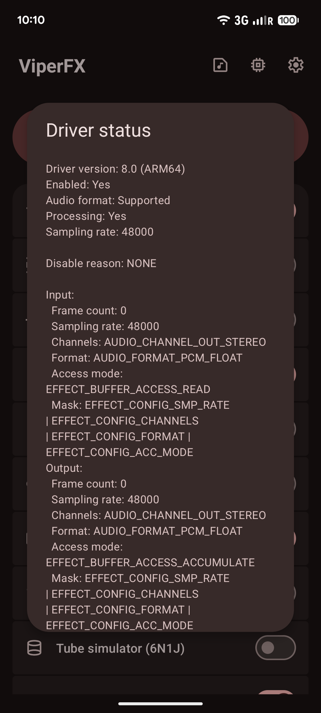
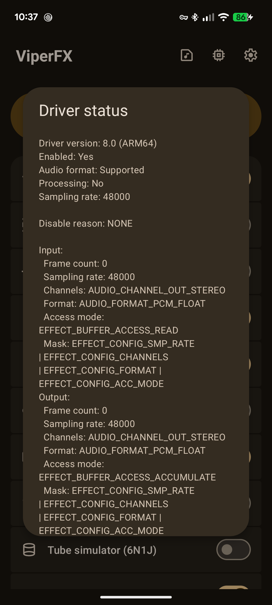
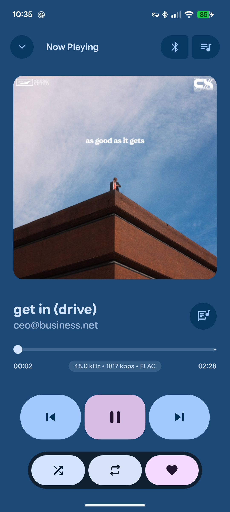
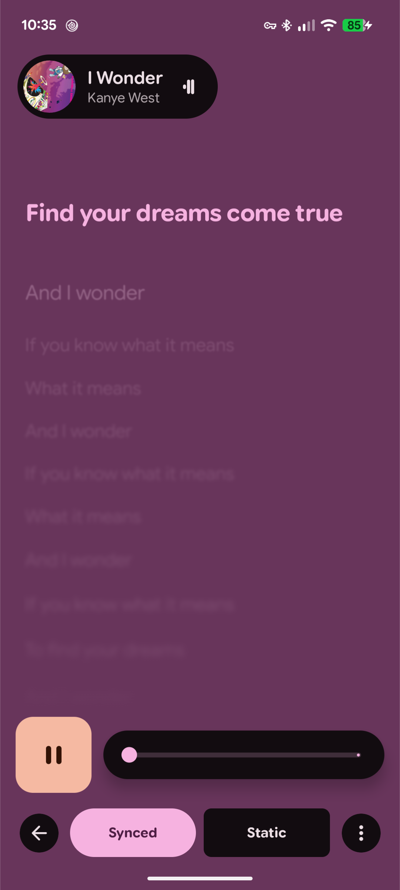

# PixelPlayer Fork

  

  
  
  
  

## Original repo: 
- https://github.com/theovilardo/PixelPlayer

# Notice: 
- This a fork of theovilardo/PixelPlayer.
- Any issues should be reported to this repo, and not original.
- Original author does not support this version (any updates will be delayed)
- 
# New features:
- Support for external EQs, like ViperFX
- Out-of-box build (just run `bash build.sh --easy-build` to build app with default debug keys)
